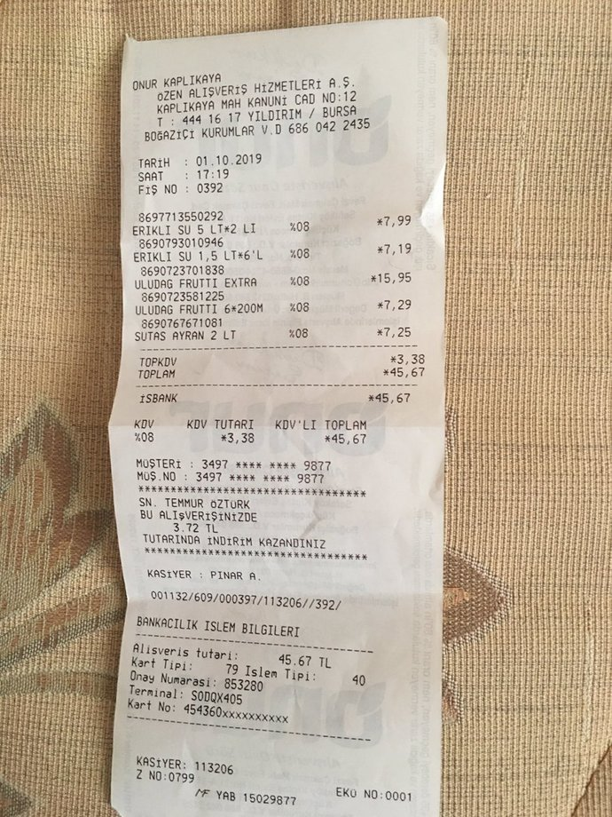

<div align="center">

<h2>Sepet</h2>

[Canlı (trysepet.com)](https://www.trysepet.com) · [GitHub](https://github.com/umutcandev/sepet) · [Sorun Bildir](https://github.com/umutcandev/sepet/issues)

[](https://nextjs.org)
[](https://react.dev)
[](https://www.typescriptlang.org)
[](https://tailwindcss.com)
[](https://ui.shadcn.com)
[](https://sdk.vercel.ai)
[](https://ai.google.dev)
[](https://authjs.dev)
[](https://orm.drizzle.team)
[](https://neon.tech)
[](https://upstash.com)
[](https://www.cloudflare.com/products/r2/)
[](https://polar.sh)
[](https://zod.dev)
[](https://vercel.com)

</div>

## İçindekiler

- [Proje Hakkında](#proje-hakkında)
- [Çözülen Problem](#çözülen-problem)
- [Örnek Denemeler](#örnek-denemeler)
- [Temel Yetenekler](#temel-yetenekler)
- [Agentic Mimari](#agentic-mimari)
- [Mimari Genel Bakış](#mimari-genel-bakış)
- [Teknoloji Yığını](#teknoloji-yığını)
- [Yerel Geliştirme](#yerel-geliştirme)
- [Lisans](#lisans)

---

## Proje Hakkında

**Sepet**, Türkiye'deki zincir ve sanal marketlerin canlı fiyatlarını tek bir yapay zekâ asistanı arkasına toplayan AI tabanlı bir alışveriş optimizasyon platformudur. Kullanıcı doğal dilde bir alışveriş listesi yazdığında, bir market fişi veya yemek görseli yüklediğinde; Sepet bu girdiyi yapılandırılmış kalemlere dönüştürür, gerçek market kataloglarıyla eşleştirir ve en uygun tek market ile en uygun iki market kombinasyonunu hesaplar.

Sistem, tarayıcı eklentisi veya elle fiyat takibi yerine **doğal dil → yapılandırılmış sepet → fiyat optimizasyonu** akışını uçtan uca otomatikleştirir.

**Canlı sürüm:** <https://www.trysepet.com>

---

## Çözülen Problem

Aynı marka çay veya zeytinyağı, farklı zincir marketlerde yüzde otuza varan fiyat farkıyla satılabiliyor. Her ürünü tek tek farklı sitelerden taramak pratik değil; mevcut karşılaştırma siteleri ise yalnızca tek ürün üzerinden çalışıyor ve sepetin bütününü optimize etmiyor.

**Sepet** bu boşluğu üç yetenekle dolduruyor:

1. Doğal dil veya görsel girdiden yapılandırılmış sepet üretmek.
2. Sepetin tamamını en uygun market kombinasyonuna yerleştirmek.
3. Gerçek harcamayı (fiş) bugünün en iyi fiyatıyla karşılaştırarak ölçülebilir tasarruf üretmek.

---

## Örnek Denemeler

Aşağıdaki görselleri indirip fiş okuma ve yemek görselinden tarif çıkarımı özelliklerini doğrudan deneyebilirsiniz.

| Örnek Fiş Görseli | Örnek Yemek Görseli |
|:---:|:---:|
|  |  |
| Fişten otomatik OCR, ürün eşleştirme ve bugünkü en uygun fiyatla karşılaştırma. | Yemek tanıma ve gerekli malzemelerin en uygun marketten alınmasına yönelik sepet önerisi. |

---

## Temel Yetenekler

### Doğal Dil Sepeti

Kullanıcı `"2 ekmek, 1 lt süt, 500g beyaz peynir"` gibi serbest metin yazar; sistem bunu miktar, birim ve normalize arama sorgusu içeren `ParsedItem` şemasına böler. Yemek veya tarif adları (`"menemen"`, `"limonata için malzemeler"`) algılandığında ham malzeme listesi otomatik türetilir.

### Fiş Fotoğrafından Otomatik OCR

Yüklenen fiş, Gemini 2.5 Flash'in çok modlu yeteneğiyle analiz edilir; market adı, tarih, toplam tutar ve ürün satırları yapılandırılmış JSON olarak çıkarılır. KDV, indirim ve kasa gibi ürün olmayan satırlar filtrelenir, `unitPrice × quantity ≈ totalPrice` tutarlılık kontrolü uygulanır.

### Yemek Görselinden Tarif Çıkarımı

Görselde bir yemek tespit edilirse model `food.dishName` ve gerekli temel malzeme listesini döner. Liste doğrudan sepet akışına aktarılır; kullanıcı tek tıkla en ucuz marketi görür.

### Sepet Optimizasyonu

`computeOptimization` modülü, eşleşen ürünlerin market başına fiyat matrisinden iki sonuç üretir:

- **Tek market en ucuz:** Sepetin tamamını karşılayan en düşük toplamlı market.
- **İki market kombinasyonu:** Market çiftleri üzerinde her kalem için ucuz olan seçilerek minimum toplam bulunur; tek market sonucuna göre TL ve yüzde tasarruf hesaplanır.

### Fiş Karşılaştırma ve Eskime Tespiti

Fişin tutarı, aynı sepetin bugünkü en iyi fiyatıyla karşılaştırılır. Tarih çok eskiyse veya tutar oranı `STALE_RATIO_THRESHOLD` üstündeyse `staleness` bayrağı işaretlenir ve rakamlar yalnızca bilgi amaçlı sunulur.

### Barkod Tarayıcı ve Ürün Arama

`@zxing/library` ile tarayıcı içinde çalışan barkod okuyucu ve 6 market (BİM, A101, Migros, Şok, CarrefourSA, Tarım Kredi) kataloğunda canlı arama yapan ürün sayfası.

### Sepetlerim ve Fişlerim

Onaylanan her sepet ve analiz edilen her fiş Postgres'te saklanır; özet tutarlar (`bestSingleTotal`, `twoMarketSavingsTL`) listede önizlenir.

### Sepet Dağılım Grafiği

**recharts** tabanlı `MarketSplitDonut`, iki market kombinasyonunda hangi alışverişin hangi markete dağıldığını donut grafikle gösterir.

### Abonelik ve Plan (Pro)

Ücretsiz ve Pro planlar; aylık kullanım kotaları plana göre belirlenir. Pro yükseltmesi **Polar** checkout'u (aylık veya yıllık ürün) üzerinden yapılır, abonelik durumu imzası doğrulanan webhook'larla `users.plan`'a senkronlanır ve kullanıcı Polar müşteri portalından planını yönetir veya iptal eder.


---

## Agentic Mimari

Sepet, klasik bir prompt-yanıt LLM uygulaması değildir. Asistan, **rolleri ayrılmış birden çok yapay zekâ ajanının** orkestra edildiği bir tool-calling pipeline'ı üzerinde çalışır.

```
Kullanıcı girdisi (metin / fiş / yemek görseli / ses)
            │
            ▼
   ┌────────────────────┐
   │  Mod Tespit Katmanı│  ← receiptApproval / receiptImage / basketApproval / text
   └────────┬───────────┘
            │
            ▼
   ┌──────────────────────────────────────────┐
   │  Ajan 1 — Parse / Vision                 │
   │  Gemini 2.5 Flash (görsel)               │
   │  Gemini 2.5 Flash Lite (metin)           │
   │  generateObject + thinkingConfig         │
   │  → BasketDraft | ImageAnalysis           │
   └────────┬─────────────────────────────────┘
            │
            ▼  (kullanıcı onayı — human-in-the-loop)
            │
   ┌──────────────────────────────────────────┐
   │  Ajan 2 — Product Lookup                 │
   │  marketfiyati API + Upstash Redis cache  │
   │  → her kalem için aday ürünler           │
   └────────┬─────────────────────────────────┘
            │
            ▼
   ┌──────────────────────────────────────────┐
   │  Ajan 3 — Match Selection                │
   │  Gemini 2.5 Flash Lite                   │
   │  Batch LLM seçimi + sha1 cache key       │
   │  → doğru ürün + sizeMismatch bayrağı     │
   └────────┬─────────────────────────────────┘
            │
            ▼
   ┌──────────────────────────────────────────┐
   │  Ajan 4 — Optimization (deterministik)   │
   │  computeOptimization()                   │
   │  → single & two-market kombinasyonu      │
   └────────┬─────────────────────────────────┘
            │
            ▼
   ┌──────────────────────────────────────────┐
   │  Ajan 5 — Title & Summary                │
   │  Gemini 2.5 Flash Lite                   │
   │  → sohbet başlığı + Türkçe özet          │
   └──────────────────────────────────────────┘
```

---

## Mimari Genel Bakış

```
┌──────────────────────────────────────────────────────────────────┐
│                       Next.js 16 (App Router)                    │
│                        React 19 · Turbopack                      │
├──────────────────────────────────────────────────────────────────┤
│ /                Doğal dil prompt + market avatarları            │
│ /asistan         AI Elements ile stream chat arayüzü             │
│ /asistan/[id]    Geçmiş sohbet                                   │
│ /sepetlerim      Kaydedilmiş sepetler                            │
│ /fis-gecmisi     Analiz edilmiş fişler                           │
│ /urun-ara        Barkod / metin ile katalog araması              │
├──────────────────────────────────────────────────────────────────┤
│ /api/assistant/chat   UIMessageStream — multi-agent pipeline     │
│ /api/transcribe       Gemini Flash Lite ile ses → metin          │
│ /api/receipts/upload  Cloudflare R2'ye direkt upload             │
│ /api/products/...     marketfiyati arama proxy + cache           │
│ /api/auth/...         NextAuth.js v5 (Google OAuth)              │
└──────────────────────────────────────────────────────────────────┘
                                 │
        ┌────────────────────────┼────────────────────────┐
        ▼                        ▼                        ▼
┌────────────────┐      ┌────────────────┐       ┌────────────────┐
│  Neon Postgres │      │ Upstash Redis  │       │ Cloudflare R2  │
│  Drizzle ORM   │      │ Cache + RL     │       │ Fiş görselleri │
└────────────────┘      └────────────────┘       └────────────────┘
        │                        │                        │
        └────────────────────────┼────────────────────────┘
                                 ▼
                  ┌────────────────────────────┐
                  │  Vercel AI Gateway         │
                  │  Google Gemini 2.5 Flash   │
                  │  Google Gemini 2.5 F. Lite │
                  └────────────────────────────┘
                                 │
                                 ▼
                  ┌────────────────────────────┐
                  │   marketfiyati.org.tr      │
                  │   6 Türk market kataloğu   │
                  └────────────────────────────┘
```

---

## Teknoloji Yığını

### Çekirdek Framework

| Katman | Teknoloji | Kullanım Amacı |
|---|---|---|
| Framework | **Next.js** (App Router, Turbopack) | RSC, route handler, streaming UI |
| UI | **React** | Server / client component ayrımı |
| Dil | **TypeScript** | Uçtan uca tip güvenliği |
| Stil | **Tailwind CSS** + `tw-animate-css` | Utility-first, tema sistemi |
| Bileşen | **shadcn/ui** + Radix UI + Base UI | Erişilebilir primitives |
| Animasyon | **Motion** (`motion/react`) | Heading rotasyonu, onboarding step geçişleri |
| Tema | **next-themes** | System / light / dark mod, SSR uyumlu |
| Grafikler | **Recharts** | Aylık tasarruf bar grafiği, market dağılım donut grafiği |
| Form / Şema | **Zod** | Tüm LLM çıktılarının doğrulanması |

### Yapay Zekâ Katmanı

| Bileşen | Teknoloji |
|---|---|
| AI SDK | **Vercel AI SDK** (`ai`, `@ai-sdk/react`) |
| Gateway | **Vercel AI Gateway** |
| Vision + Reasoning Modeli | **Google Gemini 2.5 Flash** |
| Hafif Yapılandırma Modeli | **Google Gemini 2.5 Flash Lite** |
| Sohbet UI Primitives | **AI Elements** (`components/ai-elements/*`) |
| Markdown Stream Render | **Streamdown** + Shiki + Mermaid + CJK + Math |

### Veri Katmanı

| Servis | Rol |
|---|---|
| **Neon Postgres** (`@neondatabase/serverless`) | Birincil veritabanı — sohbet geçmişi, sepetler, fişler, ürün cache, fiyat snapshot'ları |
| **Drizzle ORM** + Drizzle Kit | Şema, migration, type-safe query |
| **Upstash Redis** (`@upstash/redis`) | marketfiyati cevap cache'i, barkod→productId eşleşmesi, LLM seçim cache'i, rate limit |
| **Upstash Ratelimit** | Asistan, kimlik doğrulama ve ürün arama uçları için istek sınırlama |
| **Cloudflare R2** (`@aws-sdk/client-s3`) | Fiş görsellerinin saklanması, public CDN |

### Kimlik ve Güvenlik

| Bileşen | Teknoloji |
|---|---|
| Kimlik Doğrulama | **NextAuth.js v5 (Auth.js)** + Drizzle Adapter |
| Sağlayıcı | Google OAuth |
| Oturum | JWT strategy |
| Güvenlik Başlıkları | `lib/security/headers.ts` |

### Üçüncü Taraf Servisler

| Servis | Kullanım |
|---|---|
| **marketfiyati.org.tr** (TÜBİTAK + Ticaret Bakanlığı) | 6 Türk market için konum bazlı, resmi ve ücretsiz ürün/fiyat verisi |
| **Google Gemini API** (Vercel AI Gateway üzerinden) | LLM çağrıları |
| **Polar** (`@polar-sh/sdk`, `@polar-sh/nextjs`) | Abonelik ve ödeme — Pro checkout, müşteri portalı, webhook senkronizasyonu |

### Geliştirme Araçları

| Araç | Rol |
|---|---|
| **pnpm** | Paket yönetimi |
| **ESLint** + `eslint-config-next` | Lint |
| **Prettier** + `prettier-plugin-tailwindcss` | Format |
| **drizzle-kit** | Migration |
| **tsx** | TypeScript script runner |

### Dağıtım

| Bileşen | Yapılandırma |
|---|---|
| Hosting | **Vercel** (Edge / Node runtime, Fluid Compute, AI Gateway entegrasyonu) |
| Asistan endpoint runtime | `nodejs`, `maxDuration: 60s` |
| Görsel formatları | AVIF + WebP fallback, `image-set()` |

---

## Yerel Geliştirme

### Gereksinimler

- Node.js 20 veya üzeri
- pnpm 9 veya üzeri
- Aşağıdaki ücretsiz katmanlı servislerden hesaplar:
  - Neon (Postgres)
  - Upstash (Redis)
  - Cloudflare R2 (opsiyonel, fiş özelliği için)
  - Google Cloud (OAuth client)
  - Vercel AI Gateway
  - marketfiyati.org.tr (API)
  - Polar (opsiyonel, abonelik / Pro özelliği için)

### Kurulum

```bash
git clone https://github.com/umutcandev/sepet.git
cd sepet
pnpm install
cp .env.example .env.local
# .env.local dosyasını aşağıdaki tablodaki değerlerle doldur

pnpm db:push           # Drizzle şemasını Neon'a uygula
pnpm dev               # http://localhost:3000
```

### Komutlar

| Komut | Açıklama |
|---|---|
| `pnpm dev` | Turbopack ile geliştirme sunucusu |
| `pnpm dev:https` | HTTPS üzerinden (kamera ve mikrofon testi için) |
| `pnpm build` | Üretim derlemesi |
| `pnpm start` | Üretim sunucusu |
| `pnpm lint` | ESLint |
| `pnpm typecheck` | `tsc --noEmit` |
| `pnpm format` | Prettier |
| `pnpm db:generate` | Migration üret |
| `pnpm db:migrate` | Migration çalıştır |
| `pnpm db:push` | Şemayı doğrudan veritabanına it |
| `pnpm db:studio` | Drizzle Studio |

---

## Lisans

Bu proje hackathon süresince geliştirilmiş açık kaynak bir prototiptir. Lisans detayları için depodaki ilgili dosyaya bakınız.
