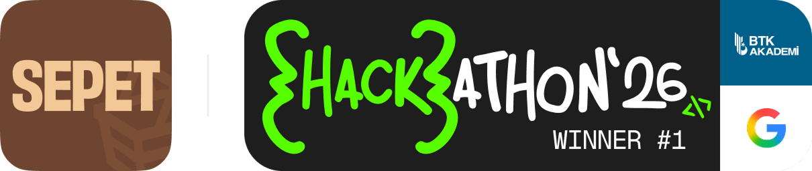

<div align="center">

<h2>Sepet</h2>

[Canlı (trysepet.com)](https://www.trysepet.com) · [GitHub](https://github.com/umutcandev/sepet) · [Sorun Bildir](https://github.com/umutcandev/sepet/issues)

[](https://nextjs.org)
[](https://react.dev)
[](https://www.typescriptlang.org)
[](https://tailwindcss.com)
[](https://ui.shadcn.com)
[](https://sdk.vercel.ai)
[](https://ai.google.dev)
[](https://authjs.dev)
[](https://orm.drizzle.team)
[](https://neon.tech)
[](https://upstash.com)
[](https://www.cloudflare.com/products/r2/)
[](https://polar.sh)
[](https://zod.dev)
[](https://vercel.com)

</div>

## Nasıl Çalışır

**Sepet**, Türkiye'deki zincir marketlerin canlı fiyatlarını tek bir yapay zekâ asistanı arkasına toplayan bir alışveriş optimizasyon platformudur.

Kullanıcı doğal dilde bir alışveriş listesi yazar ya da market fişi veya yemek fotoğrafı yükler. Sistem bu girdiyi yapılandırılmış kalemlere dönüştürür, gerçek market kataloglarıyla eşleştirir ve iki sonuç üretir: sepetin tamamını karşılayan **en ucuz tek market** ile kalemleri bölerek toplamı düşüren **en iyi iki market kombinasyonu**.

Yüklenen fişler, aynı sepetin bugünkü en iyi fiyatıyla karşılaştırılarak ölçülebilir tasarruf çıkarılır.

**Canlı sürüm:** <https://www.trysepet.com>

---

## Teknoloji Yığını

Next.js 16 (App Router, Turbopack), React 19, TypeScript, Tailwind CSS 4 ve shadcn/ui üzerine kuruludur.

Yapay zekâ katmanı Vercel AI SDK ile Google Gemini 2.5 Flash ve Flash Lite modellerini kullanır. Veri tarafında Neon Postgres (Drizzle ORM), Upstash Redis ve Cloudflare R2 bulunur. Kimlik doğrulama NextAuth.js v5, abonelik Polar, dağıtım Vercel üzerindedir. Market fiyatları marketfiyati.org.tr üzerinden alınır.

---

## Yerel Geliştirme

Node.js 20 ve pnpm 9 gerekir. Gerekli ortam değişkenlerinin tam listesi için `.env.example` dosyasına bakınız.

```bash
git clone https://github.com/umutcandev/sepet.git
cd sepet
pnpm install
cp .env.example .env.local

pnpm db:push
pnpm dev
```

| Komut | Açıklama |
|---|---|
| `pnpm dev` | Geliştirme sunucusu |
| `pnpm dev:https` | HTTPS üzerinden (kamera ve mikrofon testi için) |
| `pnpm build` | Üretim derlemesi |
| `pnpm lint` | ESLint |
| `pnpm typecheck` | Tip kontrolü |
| `pnpm db:push` | Şemayı doğrudan veritabanına uygula |
| `pnpm db:studio` | Drizzle Studio |

---

## Lisans

MIT lisansı ile yayımlanmıştır. Ayrıntılar için [LICENSE](./LICENSE) dosyasına bakınız.
